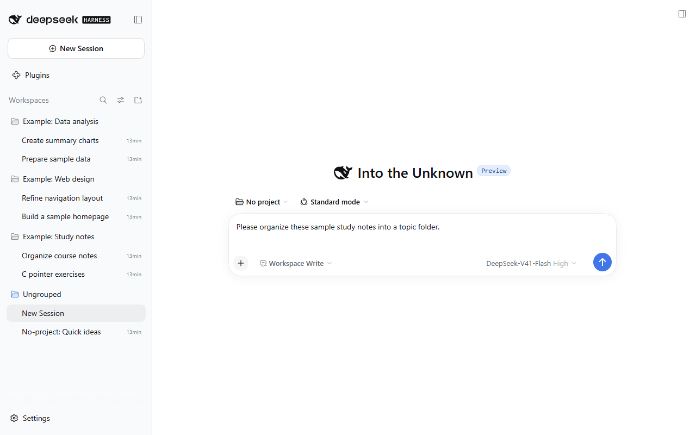
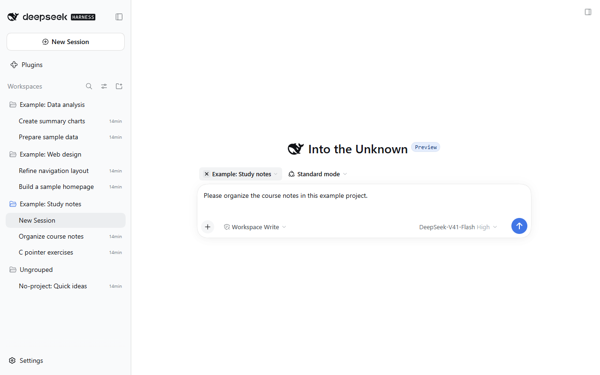
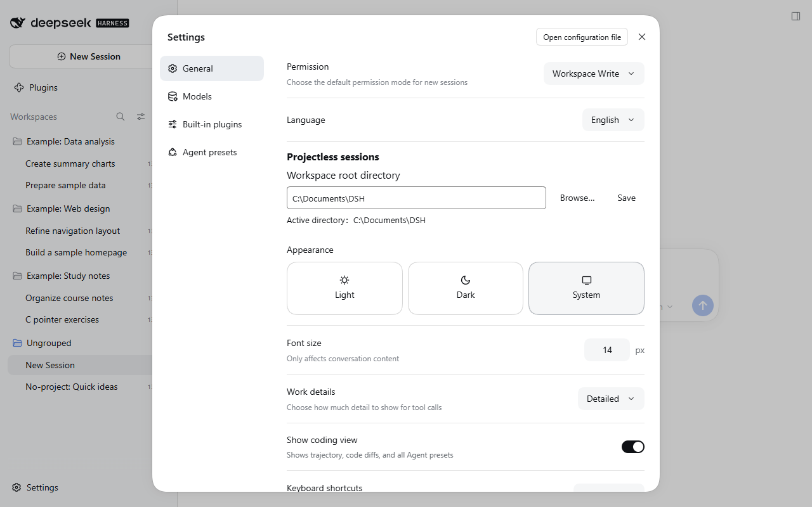

# dsh-codexlike-projectless

**English** | [简体中文](README.zh-CN.md)

Codex-like no-project conversations for DeepSeek Harness: write your message first, then create a working directory organized by date and topic when you send it.

DSH Codexlike Projectless is independently maintained with its own plugin identity and release history. Its direction is a Codex-inspired conversation workflow inside DeepSeek Harness. The repository and internal plugin are both named `dsh-codexlike-projectless`. Source attribution and MIT license details are in [NOTICE](NOTICE) and [LICENSE](LICENSE). This is not an official DeepSeek or OpenAI project.

The current version is **0.1.0**, targeting **DSH Desktop 0.2.0-rc.2 on Windows**. Independent release numbering starts at `0.1.0`. The complete flow requires both the plugin and the native DSH bridge. Installing the plugin package alone does not enable it. This repository distributes source and patch preparation scripts, not DSH's `app.asar`, user profiles or local backups.

## How it works

1. A new no-project conversation opens a browser-only draft with the native composer. No real Session, Workspace or working directory is created yet.
2. On the first send, DSH's built-in title service generates a topic using the current model. If it fails, the native fallback title is used.
3. The plugin creates `ROOT/YYYY-MM-DD/topic`, appending `_2`, `_3`, etc. for collisions. It then creates a real Session and binds the prepared title to its native event log.
4. The message goes through the native send path with its selected model, Agent preset, permissions, planning mode and attachments.
5. After acceptance, the temporary Workspace registration is removed. The conversation, directory, cwd and history remain, and the conversation appears under Ungrouped.

A circular × appears to the left of the project button above the composer on hover or keyboard focus. In an unsent editor, it switches to no-project mode and restores that draft. In a project conversation that has already sent a message, it opens a new blank no-project editor while preserving the original conversation's project and cwd. The × is hidden in no-project mode; the picker also provides a “No project” entry.

New Conversation and the shortcut open a blank editor using the current default project selection. Opening history updates that selection. A no-project conversation retains its no-project identity after its temporary Workspace is detached. The selection survives restarts; a deleted project falls back to no-project mode.

Switching through the project picker restores the most recently used unsent editor for each project and for no-project mode, including text, attachments, model, permissions, Agent preset and planning mode. Selecting the current project again does not recreate the editor. Explicitly starting a new conversation opens a blank editor without carrying over text or attachments, while previous editors remain available during that runtime. Confirmed sends clear the corresponding recoverable draft; failures retain it, and uncertain results block resending.

An uncertain send is not retried and does not delete resources. The plugin waits for confirmation from native persistent Session state. Explicit rejection or creation failure reclaims only newly allocated empty directories; existing files are not deleted.

## Screenshots

These unmodified screenshots were captured on 2026-10-03 from a real, running DSH Desktop 0.2.0-rc.2 instance on Windows with the pre-rename development build 0.7.0-local.5. The isolated profile loads only DSH's built-in components and this plugin, using the native UI without theme, pet or enhanced sidebar plugins. Three example projects, six project conversations and one ungrouped conversation were created specifically for this demonstration; no personal conversation history is included. The example conversations illustrate project membership, not model execution results. Interface labels, example project names, conversation titles and draft text are shown in English.

### No-project draft alongside project conversations

The sidebar shows three example projects and their conversations, while the current editor is in no-project mode with native model, permissions and Agent preset controls. An example under Ungrouped illustrates the difference from project-bound conversations.



### Switch from a project to no-project mode

Hovering over the project button reveals a circular × that opens the no-project editor. The selected project is “Example: Study notes”, with other projects and ungrouped conversations visible in the sidebar.



### Choose the conversation directory

General Settings lets you browse, save and inspect the effective workspace root. The example root is `C:\Documents\DSH`; you can choose your own location.



## Installation and restoration

Fully quit DSH before installation. The installer checks the original or previously installed archive against local backup records, verifies the new patch's SHA-256, and backs up the current archive, plugin and profile configuration. If an update fails, it restores the state from before that update. It changes the plugin-related dependencies and files while retaining existing workspace settings.

Requirements: Node.js 22.19 or newer, npm, and an installed copy of DSH Desktop 0.2.0-rc.2. The current installer updates an existing `dsh-codexlike-projectless` installation: the target profile must already contain its plugin directory, dependency and configuration entry. For a first installation, build this project's `dsh-codexlike-projectless-0.1.0.tgz`, install that local package through DSH's plugin management, then fully quit DSH and run the native installer. No upstream plugin is required. Disable any existing `dsh-projectless-session` before migration to avoid competing conversation handlers. This project uses separate settings and browser state keys; old settings are not migrated automatically. Existing conversations and working directories remain available.

Download or clone this repository, then run these commands from the source directory:

```powershell
npm ci
npm run verify
npm pack --ignore-scripts
node scripts/prepare-native.mjs 'original-backup/app.asar'
New-Item -ItemType Directory -Force native/backups
```

The first argument to `prepare-native.mjs` must be an unmodified DSH `app.asar`. For a first installation, use the actual installation's `resources/app.asar`. The installer defaults to `E:\DeepSeekHarness`; use `install-native.ps1 -AppDirectory 'your installation directory'` for another location. Use `-ProfileDirectory` to select a different profile.

Run the corresponding compatibility preparation script only if `dsh-better-sidebar` or Git Graph 0.4.4 is installed. The sidebar script uses the current user's default desktop profile; the Git Graph script accepts a profile path. The staged compatibility patches must belong to the same profile targeted by the installer. Keep the source directory, plugin package and backups after installation so restoration remains possible.

Prepare any required third-party compatibility patches, then install:

```powershell
# Only if dsh-better-sidebar is installed
node scripts/prepare-sidebar-compat.mjs
# Only if Git Graph 0.4.4 is installed
node scripts/prepare-git-graph-compat.mjs
.\scripts\install-native.ps1
```

The native bridge is version-specific and needs adaptation after a DSH update. The installer refuses to overwrite an unrecognized archive. The enhanced sidebar compatibility patch skips draft cwd queries and is included in the backup. On an unmodified default installation, `node scripts/prepare-native.mjs` can use its default archive path. After patching, regeneration requires an original backup. Updates from older patched builds are allowed only when verified by local installation backup records.

To restore the pre-installation state, fully quit DSH and run:

```powershell
.\scripts\restore-native.ps1 -BackupDirectory 'backup directory printed during installation'
```

In Settings → General, find the no-project conversation section. Enter a workspace root or click Browse, then Save. The UI shows the effective path; validation or save failures leave the old value in place. The setting is stored in `DSH_HOME/storages/dsh-codexlike-projectless-settings.json`, survives restarts and does not rewrite unrelated profile settings.

Without a saved override, the root comes from the profile's `dsh-codexlike-projectless.config.root`, falling back to `~/Documents/DSH`. Changes affect only future first sends; existing conversations and directories are not moved. Each first send keeps the root selected when it began, including for rollback. Setting `debug: true` enables diagnostic logging of state and paths, without message text or secrets.

## Validation and limitations

Current independent-build checks: [0.1.0 validation](docs/独立初版验证.md).

See the [historical local validation record](docs/本地完整版测试.md) (Chinese). Its versions, logs and screenshots refer to development builds before the rename; they do not establish installation and restart acceptance for `0.1.0`. Drafts support model, preset, permissions and planning mode selection, plus attachments. Tools, tasks and commands that require a real Session or execution directory become available after the first message creates the Session. Draft text and attachments exist only in runtime memory and do not survive refresh, closing or restart. Restart DSH after updating the native bridge; hot replacement of the plugin is not an installation acceptance check.

## Releases and development

Source and version downloads are available in [GitHub Releases](https://github.com/NoProblUm/dsh-codexlike-projectless/releases). This project's release workflow publishes to GitHub only; it does not publish to npm. Use the source's native preparation and installation scripts for the complete installation. The Release `.tgz` is the plugin package.

See [CONTRIBUTING.md](CONTRIBUTING.md) for development and validation, and [CHANGELOG.md](CHANGELOG.md) for version history. Paths to logs, screenshots and backups in historical validation records describe the evidence from those runs. Apart from the selected screenshots above, those runtime artifacts are excluded from the public repository. Further checks and optimization are tracked through this repository's Issues and future releases.
