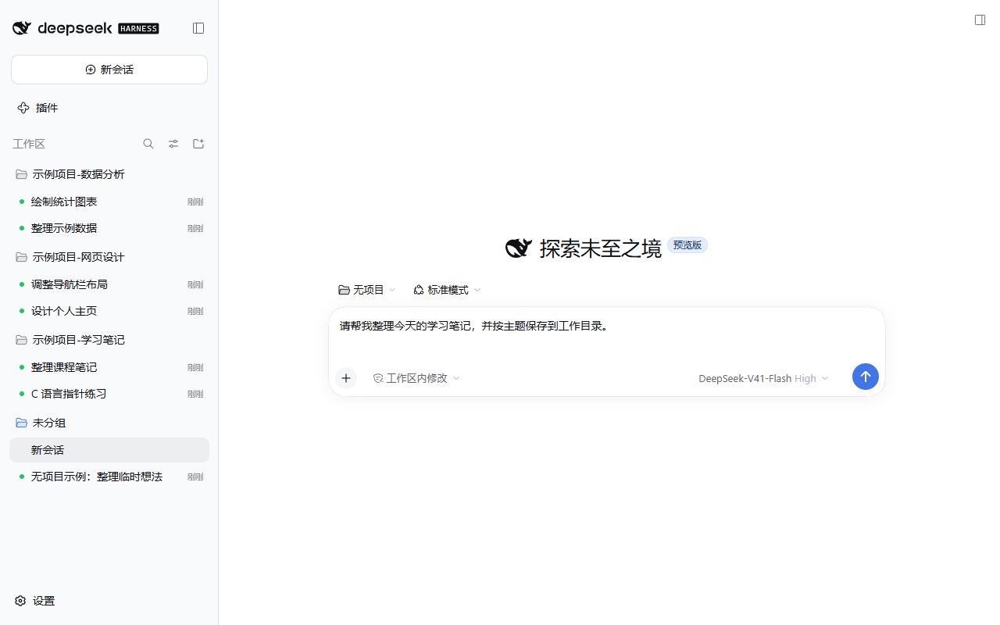
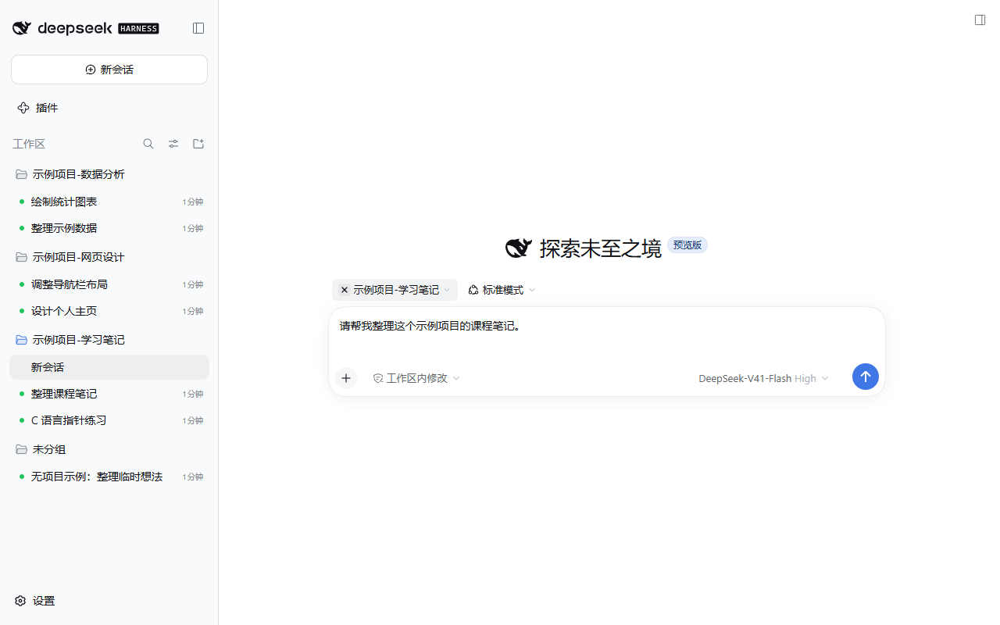
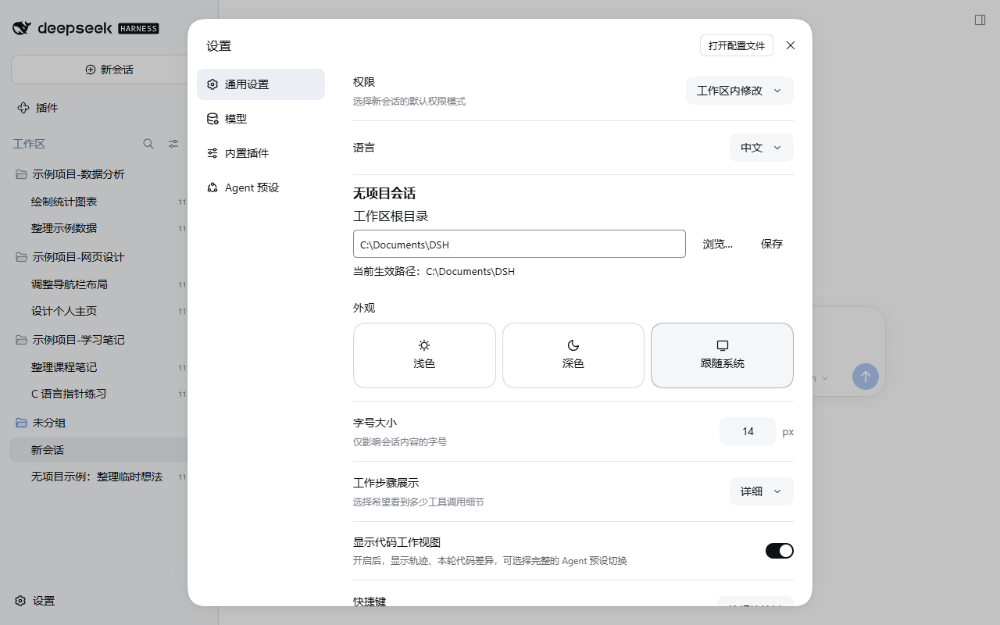

# dsh-codexlike-projectless

[English](README.md) | **简体中文**

为 DeepSeek Harness 提供类似 Codex 的无项目会话体验：先写消息，首次发送时再创建按日期和主题组织的工作目录。

DSH Codexlike Projectless 独立维护，采用自己的版本编号。仓库名和内部插件名均为 `dsh-codexlike-projectless`。源码来源和 MIT 许可说明见 [NOTICE](NOTICE) 与 [LICENSE](LICENSE)。本项目不是 DeepSeek 或 OpenAI 官方项目。

当前版本 `0.1.1`，适配 **Windows 上的 DSH Desktop 0.2.0-rc.2**。独立版本编号从 `0.1.0` 开始。完整流程需要插件和 DSH 原生接入补丁；只安装插件包不能启用完整流程。发布插件包、Windows 安装包和源码，不分发 DSH 的 `app.asar`、用户 profile 或本机备份。

1. 新建无项目会话时打开浏览器草稿，立即使用原生输入框。此时不创建真实 Session、Workspace 或工作目录。
2. 首次发送时调用 DSH 自带主题生成服务，用当前模型生成主题；服务失败时使用 DSH 原生回退主题。
3. 创建 `配置根目录/YYYY-MM-DD/主题`，重名使用 `_2`、`_3`。随后创建真实 Session，并将预生成主题与原生日志绑定。
4. 携带原生模型、Agent 预设、权限、规划模式以及附件，通过原生发送链路提交消息。
5. 接收成功后注销临时 Workspace，保留会话、目录、cwd 和历史。会话进入未分组区域。

输入框上方的项目按钮左侧，在悬停或聚焦时显示圆形 ×。未发送的编辑页点击 × 切换至无项目并恢复对应草稿；已发送的项目会话点击 × 打开新的空白无项目编辑页，保留原会话的归属和 cwd。无项目状态不显示 ×，菜单提供“无项目”。

普通“新建会话”与快捷键沿用当前默认项目，并打开空白编辑页。打开历史会话也更新默认选择；无项目首次发送并注销临时 Workspace 后仍保留无项目身份。选择记录跨重启保留，已删除项目回退至无项目。

通过项目菜单切换时，每个项目和无项目分别恢复最近使用的未发送编辑页，保留正文、附件、模型、权限、Agent 预设和规划模式。重复选择当前项目不重建编辑页。显式新建不带入旧正文或附件；旧编辑页在运行期间仍保留。发送确认成功后清除对应待恢复草稿，失败保留，结果不确定时禁止重发。

发送结果不确定时不重发、不删除资源，并等待原生持久会话状态确认。明确拒绝或创建失败时回收本次新建的空目录；已有文件不会删除。

## 运行截图

以下图片于 2026-10-03 在 Windows 上实际运行的 DSH Desktop 0.2.0-rc.2 隔离环境中拍摄，插件版本为改名前开发构建 0.7.0-local.5。仅加载 DSH 内置组件和本插件，使用原生界面，没有主题、宠物或增强侧栏插件。三个示例项目、六条项目内会话和一条未分组会话均为专门创建的演示数据，不含个人会话历史；它们用于展示项目归属，不代表模型执行结果。原图未修改。

### 无项目草稿与项目会话对比

侧边栏展示三个示例项目及其会话；当前编辑页为“无项目”，可以直接输入正文并选择原生模型、权限和 Agent 预设。“未分组”中的示例会话与项目内会话形成对比。



### 从项目切换到无项目

悬停项目按钮时显示圆形 ×，点击后进入无项目编辑页。图中选择了“示例项目-学习笔记”，左侧保留其他项目及未分组会话。



### 设置会话目录

在通用设置中配置“工作区根目录”，浏览、保存并查看当前生效路径。图中演示根目录为 `C:\Documents\DSH`，可按需要选择自己的目录。



## 安装与恢复

需要 Windows、已安装的 DSH Desktop 0.2.0-rc.2，以及 Node.js 22.19 或更新版本。使用 Release 安装包时，无需安装 npm 依赖、编译源码或手动生成补丁。安装器同时处理首次安装和更新。

### 1. 从插件市场安装（推荐）

1. 打开 DSH 插件市场，搜索 `dsh-codexlike-projectless`（DSH Codexlike Projectless）并安装。确认操作的是实际使用的 desktop profile。
2. 如果安装了旧插件 `dsh-projectless-session`，禁用它以避免冲突。
3. 在市场内完成安装，然后重启 DSH。

以上操作直接通过市场安装插件包。当前版本的完整功能还依赖匹配的原生补丁；尚未安装补丁时，请按下方独立说明配置。市场插件包不会自动安装原生补丁。

### 2. 直接安装

1. 从 [GitHub Releases](https://github.com/NoProblUm/dsh-codexlike-projectless/releases) 下载 `dsh-codexlike-projectless-0.1.1-windows-installer.zip`，解压到本机目录。不要直接在压缩包中运行。
2. 完全退出 DSH，包括托盘中的后台进程。如果安装了旧插件 `dsh-projectless-session`，先在 DSH 中禁用它。
3. 双击解压目录中的 `Install.cmd`。安装器会查找 DSH 安装目录；找不到或找到多个位置时，输入实际目录。
4. 看到“Installed / 已安装”后重新打开 DSH，在“设置 → 通用 → 无项目会话”中选择工作区根目录并保存。

默认操作 `%USERPROFILE%\.dsh\profiles\desktop`。使用其他 profile 或需要明确指定安装位置时，在解压目录打开 PowerShell，运行：

```powershell
.\install.ps1 -AppDirectory 'E:\DeepSeekHarness' -ProfileDirectory 'C:\Users\你的用户名\.dsh\profiles\desktop'
```

安装器在本机读取 DSH 原版 archive、检查版本和补丁锚点、生成原生补丁，并自动处理目标 profile 中已安装的 `dsh-better-sidebar` 与 Git Graph 0.4.4。兼容文件无法识别或 Git Graph 版本不支持时，安装停止，不写入应用或 profile。首次安装也会创建插件依赖和配置项；已有的工作目录设置及其他插件配置保留。

插件副本、原版 archive 和恢复工具保存在目标 profile 下的 `dsh-codexlike-projectless-installer` 目录。安装成功后可以删除下载的 ZIP 和解压目录；不要删除这个安装器目录，它供后续更新和恢复使用。安装器将插件依赖登记为指向该目录的本地 `link:` 依赖，不依赖下载目录。更新时下载新版安装 ZIP，退出 DSH，再运行相同入口。

### 3. 从源码安装

安装 Git 和 Node.js 后，在 PowerShell 中运行：

```powershell
git clone https://github.com/NoProblUm/dsh-codexlike-projectless.git
cd dsh-codexlike-projectless
npm ci
npm run verify
npm pack --ignore-scripts
npm run package:installer
```

`npm run verify` 执行类型检查、插件与安装器测试并构建插件。后两条命令生成插件 `.tgz`，并在 `output/` 下生成完整的 Windows 安装目录和 ZIP。

如有旧插件 `dsh-projectless-session`，先禁用它，然后完全退出 DSH，包括托盘进程。运行 `output/dsh-codexlike-projectless-0.1.1-windows-installer/` 中的 `Install.cmd`，也可以解压生成的 ZIP 后运行。安装成功后重新打开 DSH，在“设置 → 通用 → 无项目会话”中配置工作区根目录。自定义应用目录或 profile 时，使用“直接安装”中的 PowerShell 参数。开发与验证细节见 [CONTRIBUTING.md](CONTRIBUTING.md)。

### 市场安装后的原生补丁配置

原生补丁需要修改 DSH 的应用 archive，与市场安装插件包是独立的步骤。已安装匹配补丁时无需重复操作；上面的直接安装和源码安装已经包含此步骤。

从 [GitHub Releases](https://github.com/NoProblUm/dsh-codexlike-projectless/releases) 下载匹配版本的 `dsh-codexlike-projectless-0.1.1-windows-installer.zip` 并解压。完全退出 DSH，包括托盘进程，然后运行 `Install.cmd`。自定义 profile 时，使用“直接安装”中的 PowerShell 命令，指定市场安装时使用的同一个 profile。安装成功后重新打开 DSH，在“设置 → 通用 → 无项目会话”中配置工作区根目录。

当前安装器会同时安装原生补丁和本地插件副本，将市场安装的依赖替换为本地 `link:` 依赖，没有仅安装补丁的模式。后续请使用安装器更新，保持插件与补丁版本匹配。

### 从旧安装流程更新

旧流程的备份位于源码目录的 `native/backups`。更新旧补丁时，除了新版安装 ZIP，还需让安装器找到这些备份：

```powershell
.\install.ps1 -AppDirectory 'E:\DeepSeekHarness' -LegacyBackupDirectory '旧源码目录\native\backups'
```

安装器通过备份记录与 SHA-256 检查当前 archive，并寻找可验证的原版备份。找不到时停止安装，不直接覆盖未知补丁。可以用 `-OriginalArchive '原版备份\app.asar'` 明确指定原版，但仍需匹配当前安装的备份记录。原生补丁限定 DSH 0.2.0-rc.2；DSH 更新后需要重新适配。

### 恢复安装前状态

安装器会输出备份目录和完整恢复命令。安装失败时自动恢复本次操作前的应用、插件和 profile；首次安装失败也会移除本次新增的插件注册。手动恢复前完全退出 DSH，然后执行输出的命令，例如：

```powershell
powershell -NoProfile -ExecutionPolicy Bypass -File 'C:\Users\你的用户名\.dsh\profiles\desktop\dsh-codexlike-projectless-installer\install.ps1' -Restore -BackupDirectory '安装器输出的备份目录'
```

恢复的是所选备份时的 profile 配置，包括当时的其他插件配置；之后对这些配置的修改会被还原。恢复不会删除会话历史、工作目录或独立的工作区根目录设置。直接在市场卸载 `.tgz` 不会移除原生补丁，应使用恢复命令。若市场导入发生在安装器运行之前，恢复后仍会保留导入的插件，此时可再从市场卸载它。旧版备份继续使用旧源码中的 `scripts/restore-native.ps1`。

### 设置工作目录

在“设置 → 通用 → 无项目会话”中填写“工作区根目录”，或点击“浏览…”选择目录，再点击“保存”。界面显示当前生效路径；验证或保存失败时保持原值。设置保存在 `DSH_HOME/storages/dsh-codexlike-projectless-settings.json`，重启后继续生效，不改写其他 profile 设置。

未保存覆盖值时，根目录沿用 profile 的 `dsh-codexlike-projectless.config.root`；未配置则使用 `~/Documents/DSH`。修改只影响之后首次发送的新会话，既有会话和目录不迁移。一次首次发送固定使用开始发送时的根目录，回收也按原分配目录处理。`debug: true` 会开启诊断日志，只记录状态和路径，不记录输入正文或密钥。

## 验证和使用边界

`0.1.1` 的安装器集成测试覆盖首次安装、更新、配置保留和失败回滚，使用合成 ASAR 与 DSH 0.2.0-rc.2 的实际模块代码；这些测试不能代替真实 Desktop 安装与重启验收。`0.1.0` 构建检查见 [初版验证](docs/独立初版验证.md)。

历史功能验证见 [本地完整版测试](docs/本地完整版测试.md)。其中版本号、日志和截图对应改名前的开发构建，不代表 `0.1.0` 已完成安装与重启验收。草稿期支持选择模型、预设、权限、规划模式和添加附件。需要真实会话或执行目录的工具、任务与命令在首次消息创建真实会话之后使用。草稿只在运行期内存中，刷新、关闭或重启不保留正文和附件。原生补丁更新后必须重启 DSH；插件热替换不作为本地安装验收方式。

## 致谢

感谢 [Jarvis Luk](https://github.com/jarvisluk) 开源的原仓库 [jarvisluk/dsh-projectless-session](https://github.com/jarvisluk/dsh-projectless-session)，它是本项目的主要参考和源码基础。本项目包含从该 MIT 许可仓库衍生的代码，并在其无项目会话工作的基础上开发了上述类似 Codex 的会话流程。

原作者的版权声明和 MIT 许可保留在 [LICENSE](LICENSE) 中，源码来源说明见 [NOTICE](NOTICE)。本仓库由 NoProblUm 独立维护。

## 发布与开发

源码与版本下载见 [GitHub Releases](https://github.com/NoProblUm/dsh-codexlike-projectless/releases)。发布流程创建 GitHub Release，提供 `.tgz` 插件包、`-windows-installer.zip` 完整安装包和 `SHA256SUMS` 校验文件，当前不发布到 npm。源码构建流程见 CONTRIBUTING.md。

开发与验证流程见 [CONTRIBUTING.md](CONTRIBUTING.md)，版本记录见 [CHANGELOG.md](CHANGELOG.md)。本机历史测试记录中的日志、截图和备份路径用于说明当时的验证范围，除上述精选运行截图外，这些运行产物不包含在公开仓库中。后续检查与优化通过本仓库的 Issues 和版本更新跟进。
